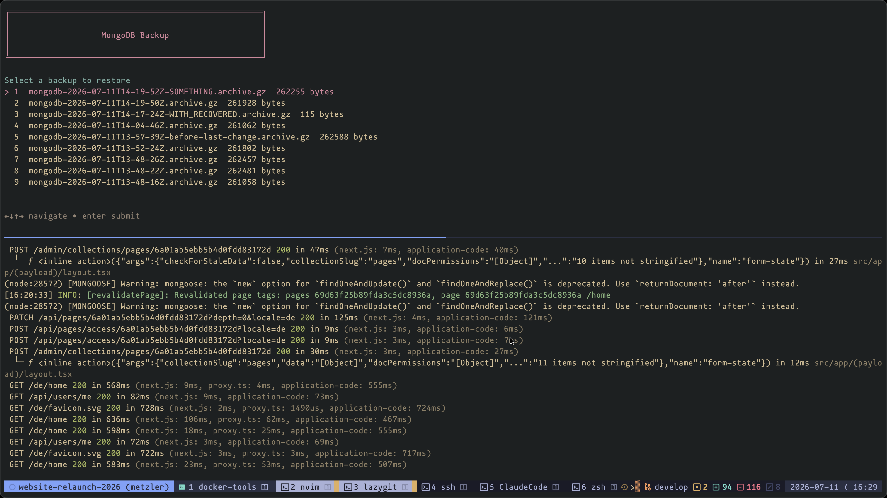

Small Docker image for scheduled MongoDB archive backups and interactive restores. It contains MongoDB's `mongodump` and `mongorestore` tools, Debian cron, and the Gum terminal UI.

## Installation

From the directory that contains the application's `docker-compose.yml`, clone this repository:

```sh
git clone git@github.com:nagy135/mongo-backup.git
```

Then modify the application's `docker-compose.yml` to add the `backup` service under `services` and the `mongo_backups` volume under `volumes`. Update `MONGODB_URI` to match the MongoDB service name, credentials, and database name used by the application.

```yaml
services:
  backup:
    build:
      context: ./mongo-backup
      dockerfile: Dockerfile
    restart: unless-stopped
    depends_on:
      - mongo
    environment:
      MONGODB_URI: mongodb://mongo:27017/my-database
      BACKUP_CRON_SCHEDULE: ${BACKUP_CRON_SCHEDULE:-0 2 * * *}
      BACKUP_RETENTION_DAYS: ${BACKUP_RETENTION_DAYS:-7}
    command:
      - /bin/sh
      - -c
      - |
        cat <<EOF | crontab -
        SHELL=/bin/sh
        PATH=/usr/local/sbin:/usr/local/bin:/usr/sbin:/usr/bin:/sbin:/bin
        MONGODB_URI="$$MONGODB_URI"
        BACKUP_DIRECTORY="/backups"
        BACKUP_RETENTION_DAYS="$$BACKUP_RETENTION_DAYS"
        $$BACKUP_CRON_SCHEDULE backup-now >> /proc/1/fd/1 2>> /proc/1/fd/2
        EOF
        exec cron -f
    volumes:
      - mongo_backups:/backups

volumes:
  mongo_backups:
```

`MONGODB_URI` must use the Compose network hostname of the existing MongoDB service (`mongo` in the example), not `localhost`. `localhost` inside the backup container refers to the backup container itself.

## Configuration

| Variable                | Default     | Description                                            |
| ----------------------- | ----------- | ------------------------------------------------------ |
| `MONGODB_URI`           | Required    | Full connection URI and database to back up.           |
| `BACKUP_CRON_SCHEDULE`  | `0 2 * * *` | Standard five-field cron expression, evaluated in UTC. |
| `BACKUP_RETENTION_DAYS` | `7`         | Delete archives older than this number of days.        |
| `BACKUP_DIRECTORY`      | `/backups`  | Archive directory inside the container.                |

For example, run a backup every six hours and retain it for 14 days:

```dotenv
BACKUP_CRON_SCHEDULE=0 */6 * * *
BACKUP_RETENTION_DAYS=14
```

## Operations

Build and start the service:

```sh
docker compose up -d --build backup
```

Create an archive immediately:

```sh
docker compose exec backup backup-now
```

List archive paths:

```sh
docker compose exec backup list-backups
```

Open the interactive UI:

```sh
docker compose exec backup backup-ui
```

The UI can create backups, list them, rename a backup by adding a `-suffix`, and restore one. A restore runs a non-destructive preflight, then requires confirmation before using `mongorestore --drop` to replace matching collections.

To restore an external archive, copy it to the backup volume first:

```sh
docker compose cp ./external.archive.gz backup:/backups/
docker compose exec backup backup-ui
```

## Persisting Archives

`mongo_backups` is a Docker named volume. It survives container recreation but is stored on the Docker host. Back up or export its archive files to off-host storage for disaster recovery.
